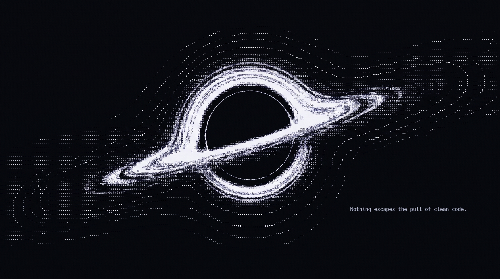

# $G_{\mu\nu} + \Lambda g_{\mu\nu} = \frac{8\pi G}{c^4} T_{\mu\nu}$

### *« Spacetime tells matter how to move; matter tells spacetime how to curve. »*
— John Archibald Wheeler

 

<!-- Badges technos thématiques (look sombre / minimaliste) -->

---

### 🌌 Approaching the Event Horizon

I am **Nathan** (`@NathanCor`), an aspiring physicist exploring where theoretical physics meets computational simulations.

* **Radius of Curvature** — Undergraduate physics student at **U-PEC** (*Université Paris-Est Créteil*).
* **Accretion Disk** — Designing and running **numerical physical simulations** (geodesics, dynamical systems, field equations).
* **Singularity** — Bridging tensor calculus, differential geometry, and high-performance algorithms.

---

### 🔭 Coordinates & Instruments

* **Focus Areas** : General Relativity, Gravitational Dynamics, Numerical Integration, Quantum Systems.
* **Transmissions** : Emitting signals through [nathan.courbaron@etu.u-pec.fr](mailto:nathan.courbaron@etu.u-pec.fr).

---

### 📡 Observational Data

  

